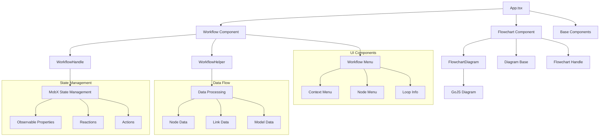
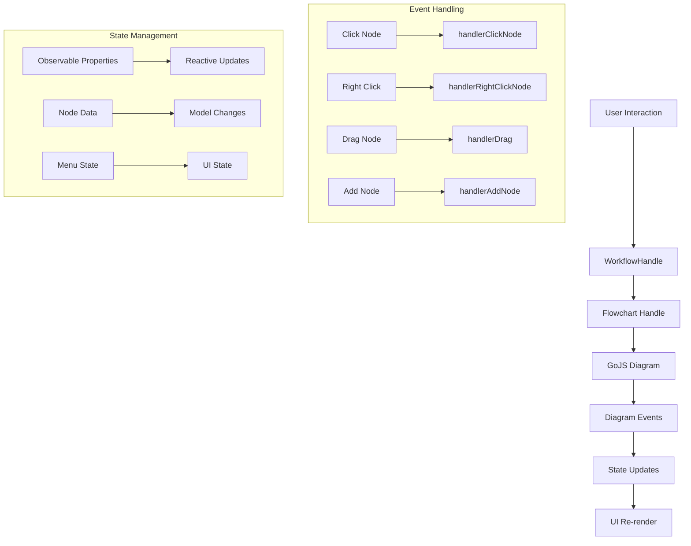
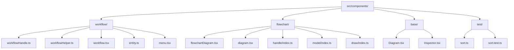
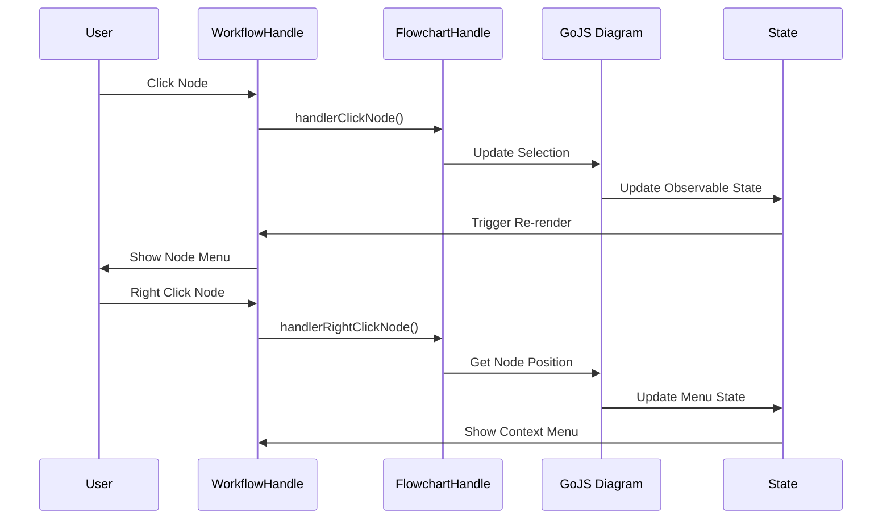
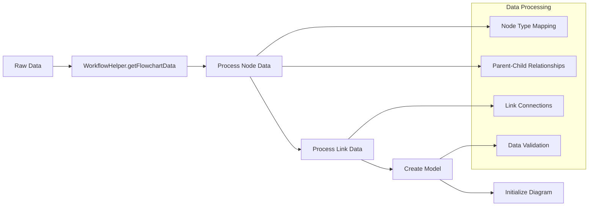
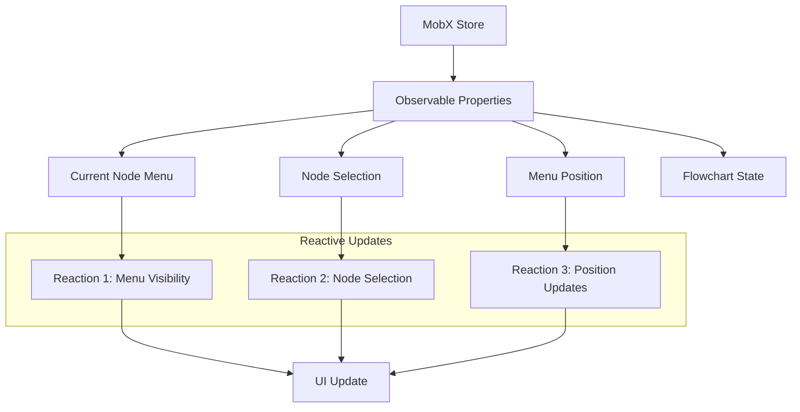
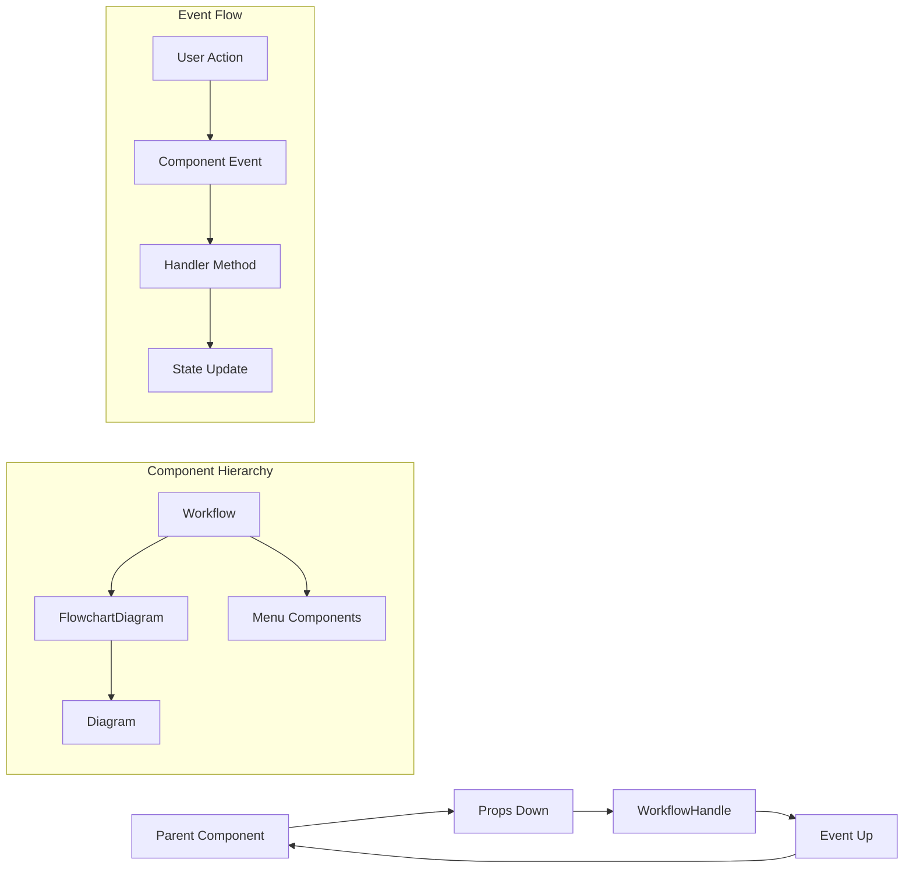

# 代码流程图分析

## 项目整体架构



## 核心模块数据流



## 节点类型和关系

```mermaid
graph LR
    A[ActionNode] --> B[Condition]
    A --> C[Branch]
    A --> D[Loop]
    A --> E[ExtractData]
    A --> F[Click]
    A --> G[EnterText]
    A --> H[Navigate]
    
    subgraph "Node Properties"
        I[key: string]
        J[type: ActionNodeType]
        K[label: string]
        L[parentKey: string]
        M[childKeys: string[]]
        N[data: any]
    end
    
    A --> I
    A --> J
    A --> K
    A --> L
    A --> M
    A --> N
```

## 文件结构关系



## 事件处理流程



## 数据转换流程



## 状态管理模式



## 组件通信模式


